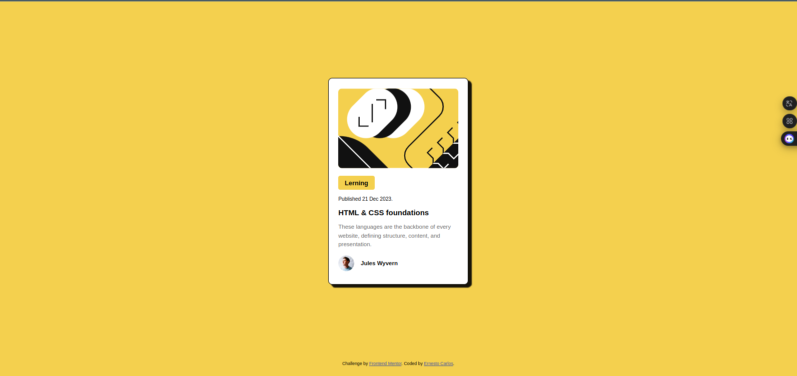

# Frontend Mentor - Blog preview card solution

This is a solution to the [Blog preview card challenge on Frontend Mentor](https://www.frontendmentor.io/challenges/blog-preview-card-ckPaj01IcS). Frontend Mentor challenges help you improve your coding skills by building realistic projects. 

## Table of contents

  - [The challenge](#the-challenge)
  - [Screenshot](#screenshot)
  - [Links](#links)
- [My process](#my-process)
  - [Built with](#built-with)
  - [What I learned](#what-i-learned)
  - [Continued development](#continued-development)
  - [Useful resources](#useful-resources)
- [Author](Ernesto Carlos)

### The challenge

- Blog preview card challenge on Frontend Mentor

### Screenshot

### Links

- Solution URL: https://github.com/eneskrlos/ch-blog-preview-card
- Live Site URL: [https://eneskrlos.github.io/ch-blog-preview-card/](https://eneskrlos.github.io/ch-blog-preview-card/)

## My process

### Built with

- Semantic HTML5 markup
- CSS custom properties
- Flexbox
- CSS Grid
- Mobile-first workflow

### What I learned

El uso de grid y flexbox.

### Useful resources

- MDN

## Author

- Frontend Mentor - [@eneskrlos](https://www.frontendmentor.io/profile/eneskrlos)
